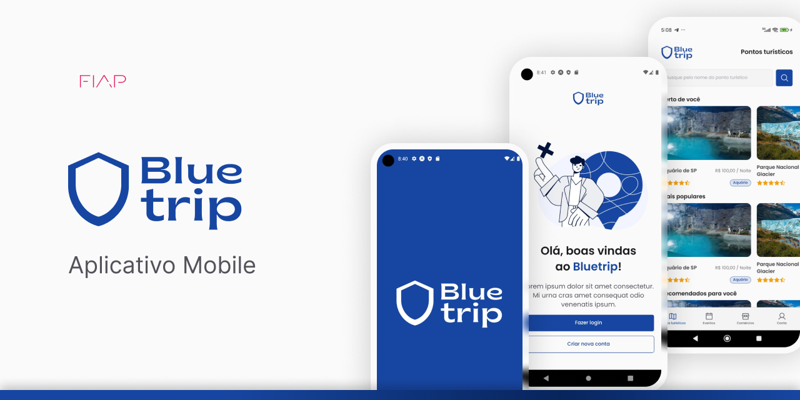

# 🔱 Bluetrip

## 💡 Explicação do projeto
Bluetrip é uma aplicação mobile de turismo focada em oceanos, rios e lagos. O objetivo principal é fornecer uma experiência enriquecedora para turistas e entusiastas da natureza, oferecendo informações detalhadas sobre pontos turísticos e eventos.

## 👥 Equipe
Este projeto está sendo desenvolvido pelos seguintes membros:

- RM98110 - André Rohregger Machado (2TDSPV)
- RM99565 - Erick Nathan Capito Pereira (2TDSPV)
- RM550841 - Lucas Araujo Oliveira Silva (2TDSPW)
- RM551886 - Victor Luca do Nascimento Queiroz (2TDSPV)
- RM99455 - Vinícius Martins Torres Abdala (2TDSPV)

## 💻 Tecnologias
As principais tecnologias, bibliotecas, ecossistemas e frameworks incluídos no projeto são:

- C#
- ASP.NET MVC
- HTML, CSS e JavaScript

## 🖌️ Vídeo da aplicação
https://github.com/ericknathan/bluetrip-dotnet/assets/53922235/00eeb2c6-cb1c-48dc-8755-1f1fde4e1974

